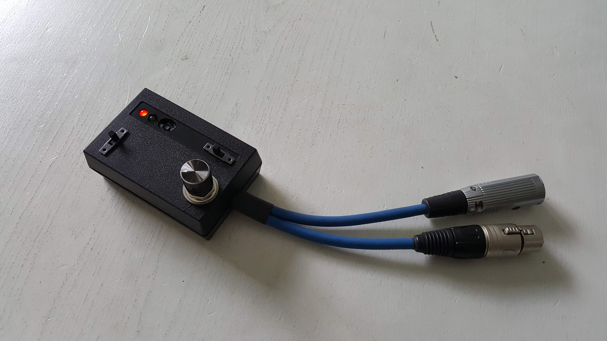
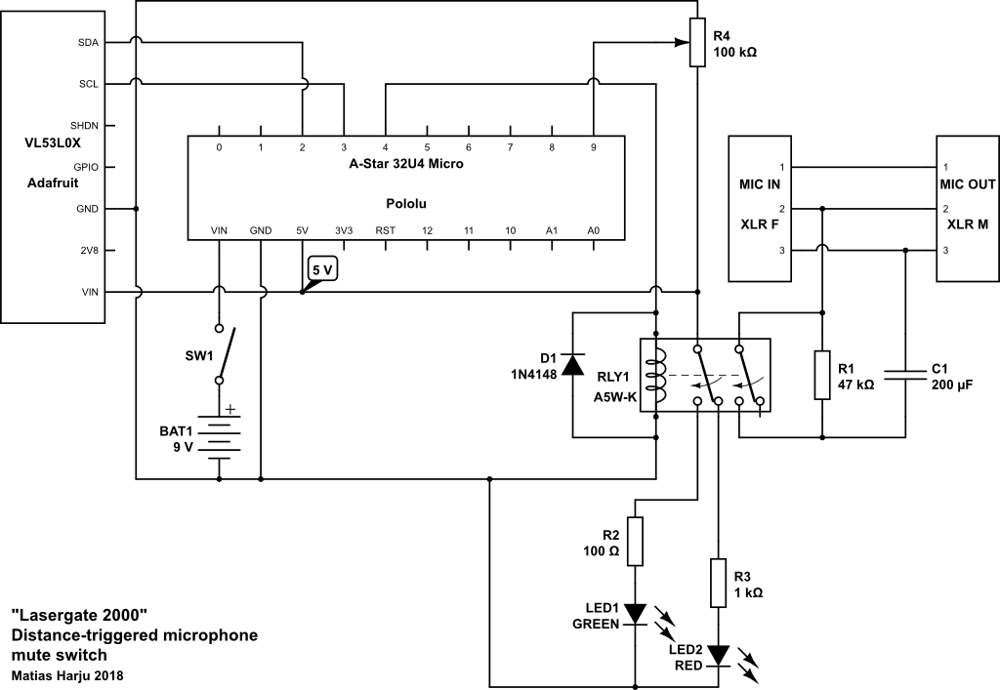
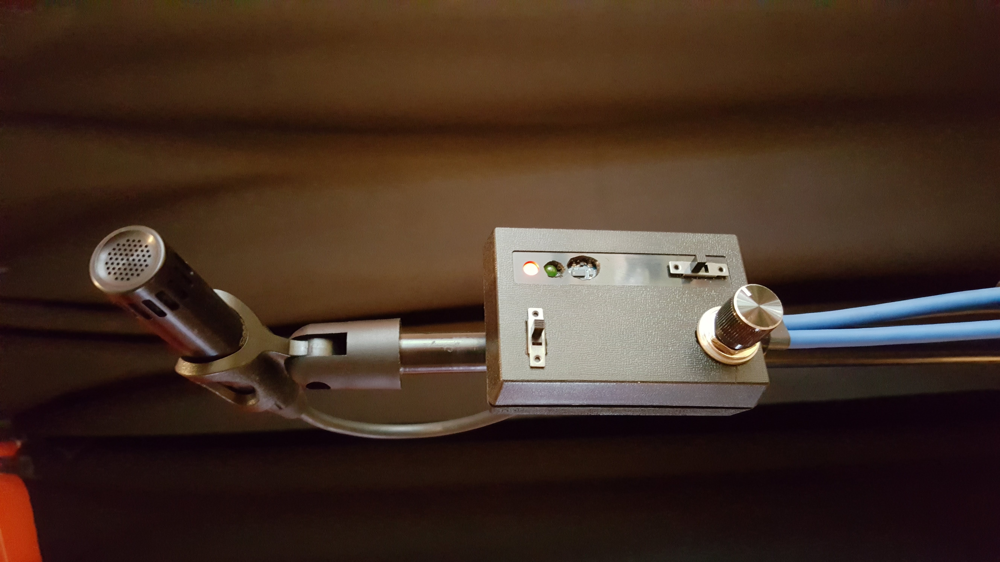
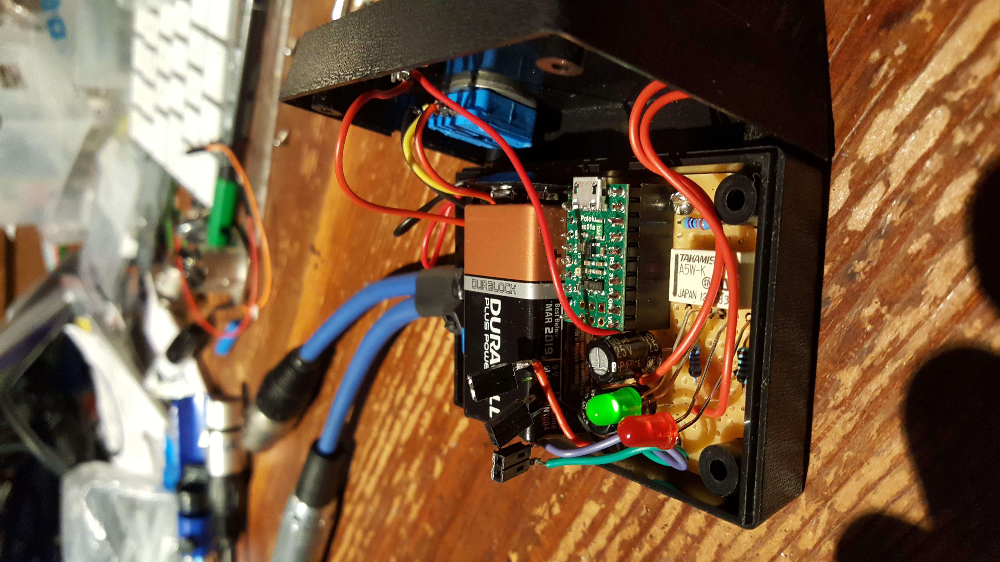

"Lasergate 2000" is a distance-triggered signal gate that keeps a microphone muted until a person steps in front of it. It's useful for installations and live situations, etc., where noise leak to the microphone should be prevented until someone really wants to vocalise something to the mic. Without a physical switch it's convenient for many situations.

The gadget uses a Time-of-Flight (ToF) sensor for measuring distance, and an Arduino-compatible board for logic. A relay is used to connect/disconnect the microphone signal as well as control the indication LED's. This version runs on a 9 V battery, although phantom power would be handy for some future versions.

I designed and built this in 2018 for a sound installation of mine. Feel free to use the circuit diagram and Arduino sketches for your own purposes! However, if you come up with improvements, please share them with me!

